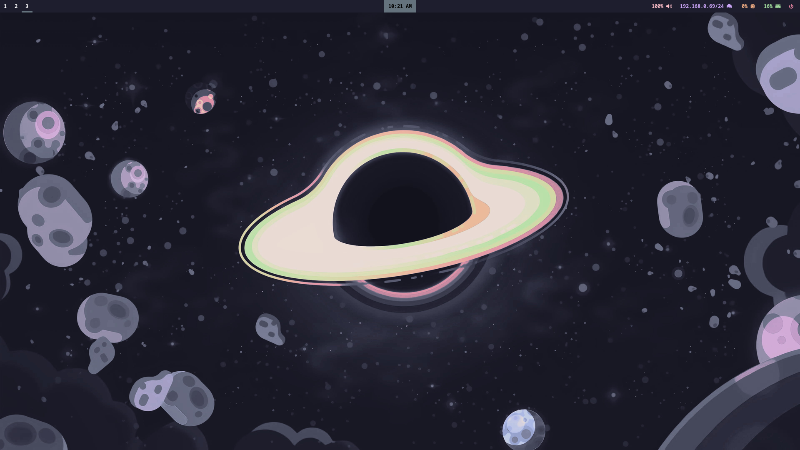
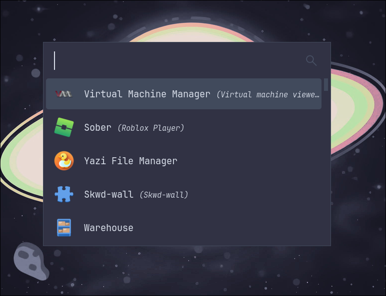
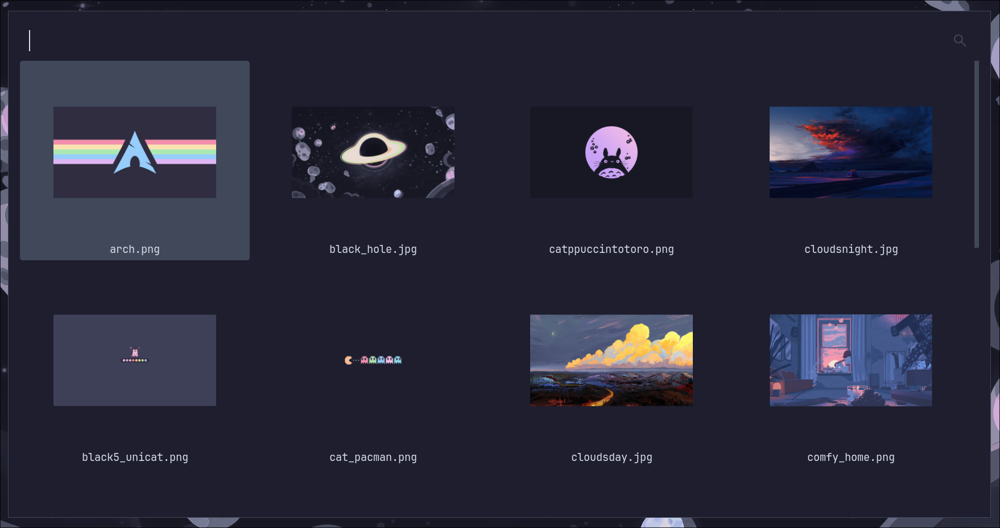

# A minimal hyprland config

---

## Deps

| Component | Tool | Description |
| :--- | :--- | :--- |
| **WM / Compositor** | [Hyprland](https://hyprland.org/) | Dynamic tiling Wayland compositor |
| **Status Bar** | [Waybar](https://github.com/Alexays/Waybar) | Highly customizable Wayland bar |
| **Wallpaper** | [awww](https://github.com/L3ur/awww) | Minimal, fast Wayland wallpaper daemon |
| **App Launcher** | [Rofi-wayland](https://github.com/lbonn/rofi-wayland) | Application launcher and switcher |
| **Screen Capture** | [Grim](https://sr.ht/~emersion/grim) + [Slurp](https://github.com/emersion/slurp) | Region selection & screenshot utility |
| **Image Annotation** | [Satty](https://github.com/gabm/satty) | Modern screenshot annotation tool |
| **Fonts** | [ttf-jetbrains-mono-nerd](www.nerdfonts.com/font-downloads) [otf-font-awesome](www.fontawesome.com) | Needed for waybar |
| **Lockscreen** | [hyprlock](https://wiki.hypr.land/Hypr-Ecosystem/hyprlock/) | Lockscreen utility for hyprland ecosystem |

---

## Keybindings

| Keybinding | Action |
| :--- | :--- |
| `ALT` + `Return` | Open Terminal |
| `ALT` + `Space` | Rofi |
| `ALT` + `Shift` + `Q` | Power Menu |
| `ALT` + `Shift` + `W` | Wallpaper switcher |
| `ALT` + `Q` | Close Window |
| `ALT` + `Print` | Screenshot (select area) |
| `Print` | Screenshot (entire screen) |

---

## Screenshots

## Credits & Acknowledgments

* **Rofi Theme:** Based on [outtheme-rofi-theme](https://github.com/OuterFrog/outtheme-rofi-theme) by **OuterFrog** (with minor edits).
* **Catppuccin:** Colors scheme by the [Catppuccin Community](https://github.com/catppuccin/catppuccin).
